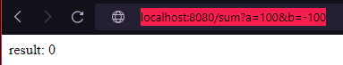
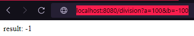
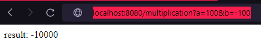

# RestCalculator

Rest api that acts a basic calculator

Has 2 modules, Rest module that receives the http request with the parameters and sends it to the calculator module using topics from kafka. Module calculator receives the input, does the calculation and sends it back to the rest module so it can give the result to the user. 

Both modules act as producer and consumer

To run the program you have to run the docker compose file using the command: 

docker-compose up --build 

It will build both the modules and allocate them on ports 8080 and 8081. Kafka will run on port 9092

(Due to some problems when allocating the image to the docker, no connection is estabilished to port 9092, so it runs only locally if you create the kafka broker mannualy not with docker compose file)

**Unit tests done only for Calculator module**

Sum:

Subtraction:

Division:

Multiplication:

